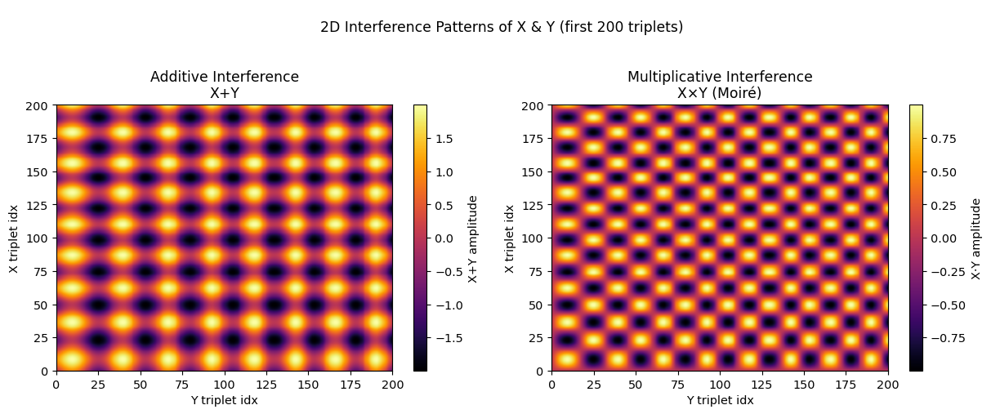

# Prime Waves Toolkit

A lightweight launch point for exploring how  
**prime numbers → triplets → gap sequences → FM waves → 2-D interference fields**,  
and the broader Ω–Φ framework, 8DHD, and fractal prime structures.

---

## Contents

### Scripts

| File                                  | Description                                                  |
|---------------------------------------|--------------------------------------------------------------|
| [`prime_fm.py`](scripts/prime_fm.py)          | Generate primes, triplets, FM-sine waves, and interference maps. |
| [`latex2pdf_letter.py`](scripts/latex2pdf_letter.py) | Compile the LaTeX math recipe into a US-Letter PDF.          |

### Resources

- [`equations.pdf`](equations.pdf)  
  The rendered LaTeX explainer of the math/algorithm pipeline.  
- **Website**: <https://theprimescalarfield.com/>  
  High-level narrative, visuals, and ongoing updates.  

---

## Quick Start

# 1) Install dependencies (if you haven't already)
pip install numpy matplotlib scipy

# 2) Generate & save a 2D interference map
python scripts/prime_fm.py --triplets 200 --up 20 --save out.png

# 3) Render the algorithmic steps to PDF
python scripts/latex2pdf_letter.py -o equations.pdf

Acknowledgements

    I did not invent the prime‐triplet field—credit goes to the original
    Prime Scalar Field community (theprimescalarfield.com & r/thePrimeScalarField).
    As far as I know though the π‑twist recursion & scalar‑generated torus nesting are novel
    This toolkit simply explores the beautiful structures they uncovered.

License

Distributed under the MIT License.
See LICENSE for full details.
